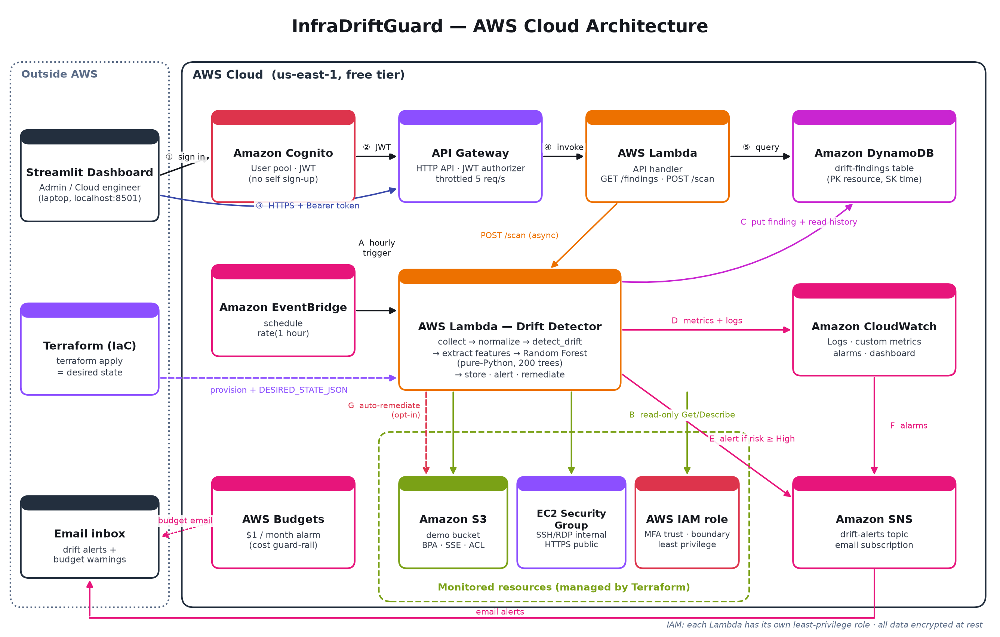

# InfraDriftGuard — AI-Based Infrastructure Drift Detection on AWS

**BCSE355L Cloud Architecture Design · Project Phase-I**

InfraDriftGuard continuously compares the infrastructure you **declared in Terraform** with what is **actually running in AWS**. It rates every difference (drift) as **Low / Medium / High / Critical** with an explainable Random Forest, emails you about dangerous ones, and can optionally undo the two most dangerous kinds of change automatically. Everything runs serverless inside the AWS free tier.



## What it does

| | |
|---|---|
| **Monitors** | S3 bucket (public access, ACL, encryption, versioning, logging, lifecycle, policy), EC2 security group (SSH/RDP/HTTPS/custom ports, egress, SG references), IAM role (actions, resources, effect, MFA trust, cross-account trust, permissions boundary) |
| **Detects** | Attribute-level diff between the Terraform-rendered desired state and the live configuration, every hour or on demand |
| **Classifies** | 9 security features → Random Forest (200 trees) → risk level. Changes the model has never seen are labelled **Review**, not guessed |
| **Explains** | SHAP global and per-prediction explanations |
| **Responds** | DynamoDB history, SNS email alerts, CloudWatch metrics, alarms and dashboard, opt-in auto-remediation |
| **Serves** | REST API (API Gateway + Cognito JWT) and a Streamlit dashboard |

## Repository layout

```
├── docs/                 Project report + Phase-I documents (.docx / .pdf)
├── architecture/         AWS_Architecture.png, System_Architecture.png, Workflow.png
├── dataset/
│   ├── raw/              raw_records.json (full desired/actual states)
│   ├── processed/        dataset.csv (711 records, 9 features + label)
│   └── Dataset_Details.docx, dataset_description.pdf
├── src/
│   ├── backend/          drift_engine, feature_extraction, scenarios, dataset generator
│   ├── ml_model/         training, evaluation audit, SHAP, model export, models/
│   ├── aws/
│   │   ├── collectors/   boto3 collectors + normalisers (S3, SG, IAM)
│   │   ├── lambda/       detector_handler, api_handler, rf_predict, model/rf_model.json
│   │   └── terraform/    all AWS infrastructure (Lambda, EventBridge, DynamoDB, SNS,
│   │                     API Gateway, Cognito, CloudWatch, Budgets, monitored resources)
│   └── frontend/         Streamlit dashboard (offline analyzer + live AWS findings)
├── results/              metrics, confusion matrices, SHAP plots, screenshots
├── presentation/         review slides
├── scripts/              diagram + document generators
└── tests/                219 pytest tests (moto-simulated AWS, no account needed)
```

## Quick start (local, no AWS account)

```bash
python -m venv venv && venv\Scripts\activate      # Linux/macOS: source venv/bin/activate
pip install -r requirements.txt
python -m pytest tests -q                           # 218 passed, 1 skipped
streamlit run src/frontend/app.py                   # http://localhost:8501
```

Rebuild the pipeline from scratch:

```bash
python src/backend/dataset_generator.py     # dataset/ (deterministic, seed 42)
python src/backend/validate_dataset.py
python src/ml_model/ml_pipeline.py          # train + evaluate → src/ml_model/models, results/
python src/ml_model/shap_explainability.py  # results/shap/
python src/ml_model/export_model.py         # src/aws/lambda/model/rf_model.json
python scripts/draw_architecture.py         # architecture/*.png
python scripts/build_docs.py                # docs/*.docx
```

## Deploy to AWS (free tier)

Prerequisites: an AWS account (turn on MFA for the root user and use an IAM admin user), the [AWS CLI](https://aws.amazon.com/cli/) set up with `aws configure`, and [Terraform ≥ 1.5](https://developer.hashicorp.com/terraform/install).

```bash
cd src/aws/terraform
terraform init
terraform apply -var="alert_email=you@example.com"
terraform output -json > outputs.json
```

1. Click **Confirm subscription** in the AWS SNS email.
2. Cognito emails you a temporary password. Run `streamlit run src/frontend/app.py`, open **Live AWS findings**, sign in, and set a new password (third box).
3. Click **Scan now**. All three resources should show *No drift*.
4. **Demo drift:** in the EC2 console, add an inbound rule to the `drift-demo-sandbox-web-sg` security group (SSH, port 22, source `0.0.0.0/0`). Click **Scan now**. The finding is **Critical**, and an alert email arrives.
5. Optional: `terraform apply -var="alert_email=..." -var="auto_remediate=true"`. The next scan removes the public SSH rule by itself.
6. **When finished:** `terraform destroy`

**Cost:** about 720 Lambda runs, a few hundred DynamoDB writes and a handful of emails per month, which stays within the free tier. A **$1 AWS Budget** emails you at 50% actual or 100% forecast spend.

| Variable | Default | Meaning |
|---|---|---|
| `alert_email` | (required) | Address for alerts and budget warnings |
| `scan_schedule` | `rate(1 hour)` | EventBridge schedule |
| `alert_min_risk` | `High` | Lowest risk that triggers an email |
| `auto_remediate` | `false` | Revert public S3 access and SSH/RDP open to `0.0.0.0/0` |
| `monthly_budget_usd` | `1` | Budget alarm threshold |

## Results (summary)

| Model / evaluation | Accuracy | Macro F1 |
|---|---|---|
| Random Forest, record-level split (568/143) | 1.000 | 1.000 |
| Random Forest, whole scenarios held out (592/119) | 0.370 | 0.296 |
| Decision Tree, whole scenarios held out | 0.706 | 0.565 |

The record-level split lets the model see every scenario during training, so its score mostly shows that it learned the labelling rules. The scenario-held-out split is the honest measure of how it handles new kinds of drift. Both are reported on purpose. See `docs/Development_Log.md` and `results/ml_evaluation_audit.json`.

## Team & branches

`main` ← `develop` ← `feature/student1`, `feature/student2`. Students open PRs into `develop`. The release tag is `v1.0-Phase1`.

## License

MIT. See [LICENSE](LICENSE).
